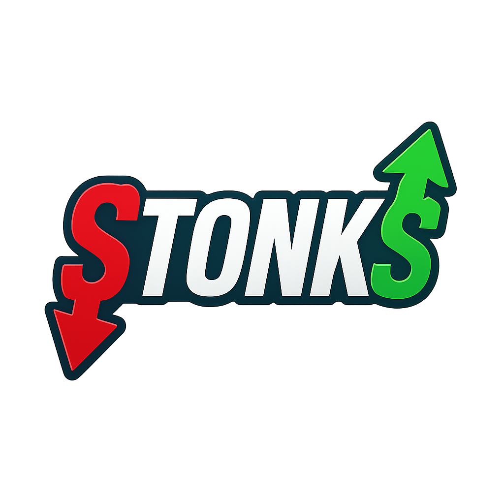
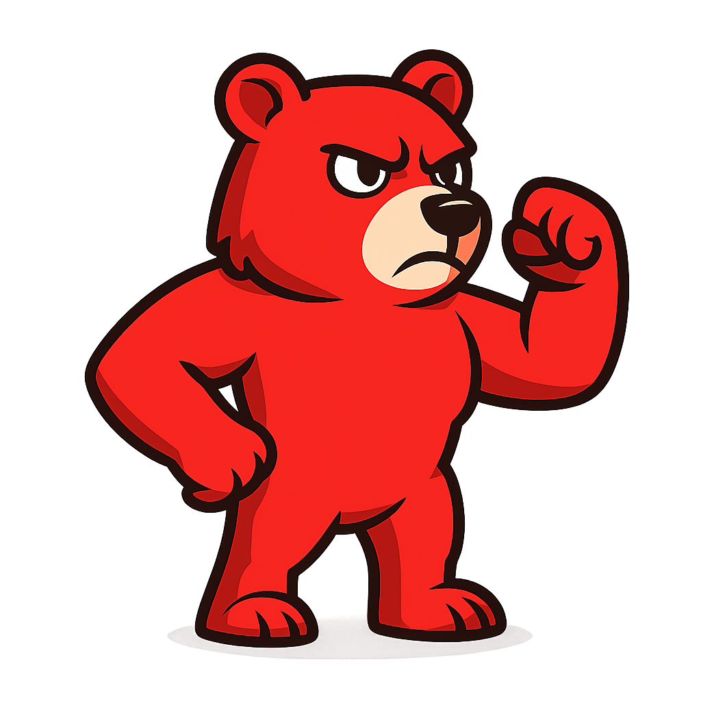
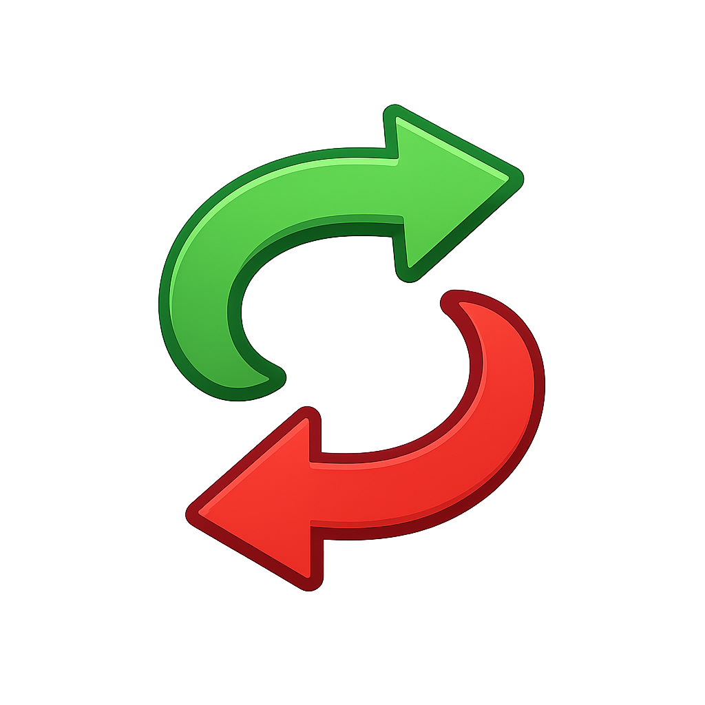
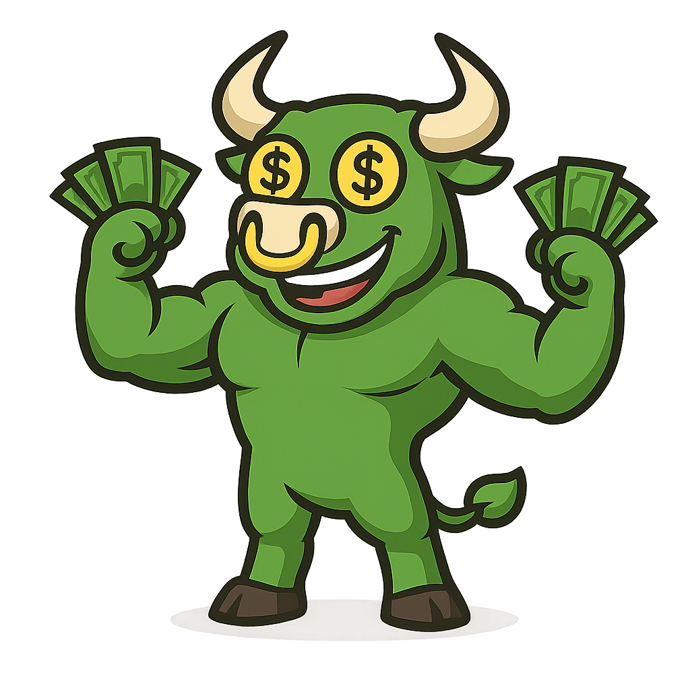
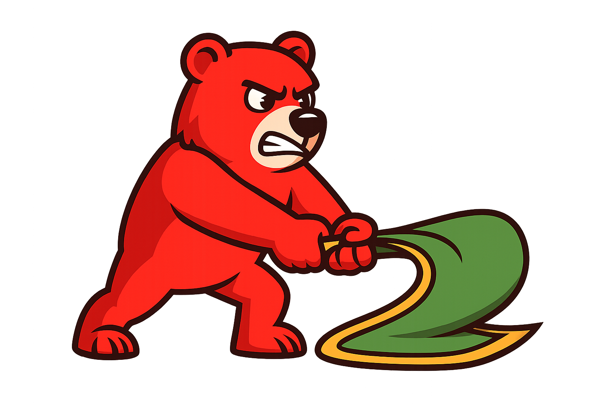

<p align=center>
    
</p>
# 💹 Stonks 

**Stonks** is a fast-paced trading-inspired Plinko prototype built with **Pixi.js**.  

Launch your multiplier into the volatile market, bounce through bullish and bearish nodes, and collect gains before you get liquidated.  
*Play Trade smart. Avoid the rug. 📉📈*
<p align=center>
    
    
</p>

---

## 🎮 Game Description

**Stonks – The Bull & Bear Trading Plinko**

*Test your trading reflexes in this dynamic Plinko-inspired game where markets shift in real time.*

- **Theme:**
  Step into the volatile world of trading, where a bullish green bull and a bearish red bear represent market sentiment. Each round simulates unpredictable price action, with your multiplier bouncing between gains and losses.

<p align=center>
    
</p>

- **Core Mechanics:**
  - You launch a *flying multiplier* from the center of the grid.
  - As it travels diagonally across the board, it collides with randomly spawning *redirectors*.
  - Redirectors appear in three types:
    - **Bounce Nodes (≈95%)** – Reverse your vertical movement, extending your run.
    - **Win Nodes (≈2.5%)** – Lock in your current multiplier and end the round in profit.
    - **Lose Nodes (≈2.5%)** – Instantly liquidate your position, ending the round with no payout.
  - Each movement leaves a colored trail:
    - **Green line** while price moves upward.
    - **Red line** when price falls.

- **Multipliers:**
  - Your multiplier grows incrementally as you survive longer.
  - On collision with a win node, your final multiplier is applied to your bet.

<p align=center>
    
</p>

- **Round Flow:**
  1. **Launch:** Start the round with one click.
  2. **Navigate:** The multiplier bounces and shifts direction on collisions.
  3. **Collect or Lose:** Hit a Win Node to cash out or a Lose Node to get liquidated.

- **Special Features:**
  - **Turbo Mode:** Increase simulation speed 3× for fast-paced gameplay.
  - **Real-Time Balance Update:** Your winnings are applied immediately after each round.
  - **Rug Pull Events:** Sudden loss scenarios simulating market collapses.

- **Payout Formula:**
	- **Final Win** = Bet × Current multiplier


> **Important:** This prototype uses simple random logic for demonstration. A secure RNG is **not implemented**.

---

## 🛠️ Platform & Technologies

- **Pixi.js** (WebGL renderer)
- TypeScript
- Vite (build tool)
- HTML5 + CSS3

The game runs in any modern desktop or mobile web browser.

---

## ▶️ How to Run Locally

1. **Clone this repository:**
   ```bash
   git clone https://github.com/alzenioGames/stonks.git
2. **Navigate into the project folder:**
	```bash
	cd waffle-land
3. **Install dependencies:**
	```bash
	npm install
4. **Start the development server:** 
	```bash
	npm run dev
## 🎲 Random Math Disclaimer

This project currently uses **basic pseudo-random math** to simulate game outcomes.  
**No secure Random Number Generator (RNG) is implemented yet.**  
This prototype is not suitable for real-money gaming or production use.


## 💰 Paytable

| Multiplier Range | Description        |
|------------------|--------------------|
| **1.00× – 1.50×** | Minor gains        |
| **1.51× – 2.50×** | Solid profit       |
| **2.51× – 5.00×** | Major win          |
| **5.01×+**        | Legendary stonks   |

> **Note:** Multipliers scale dynamically depending on how long you survive. There is no fixed payline table.

**Key Elements:**

- **Bounce Node** – Reverses vertical movement.
- **Bull Win Node** – Collects your multiplier.
- **Bear Lose Node** – Liquidates instantly.
<p align=center>



</p>


## 🗂️ Project Structure

    stonks/
    ├── index.html              # Entry point
    ├── package.json            # Project metadata and dependencies
    ├── tsconfig.json           # TypeScript configuration
    ├── vite.config.ts          # Vite build configuration
    ├── eslint.config.mjs       # ESLint configuration
    ├── public/                 # Public assets served by Vite
    │   ├── favicon.png
    │   ├── style.css           # Main styles
    │   ├── assets/             # Preloaded assets (sprites, UI, sounds)
    │   │   ├── main/           # UI and sound assets
    │   │   └── preload/        # Preload logos
    │   └── symbols/            # Game symbols images
    ├── raw-assets/             # Additional raw assets
    │   ├── main/               # Source assets (UI, sounds)
    │   └── preload/            # Source preload assets
    ├── scripts/                # Build or asset scripts
    │   └── assetpack-vite-plugin.ts
    ├── src/                    # Application source code
    │   ├── app/                # App-specific code (screens, popups, UI)
    │   │   ├── screens/        # LoadScreen, MainScreen, etc.
    │   │   ├── popups/         # PausePopup, SettingsPopup
    │   │   ├── ui/             # UI logic (buttons, labels)
    │   │   └── utils/          # User settings helpers
    │   ├── engine/             # Engine components (audio, resize, navigation)
    │   ├── main.ts             # Application entry point
    │   ├── manifest.json       # Manifest metadata
    │   ├── pixi-mixins.d.ts    # Pixi.js typings
    │   └── vite-env.d.ts       # Vite environment typings
    └── README.md               # This documentation

## 🧑‍💻 Development Status

This is a **proof of concept** for demonstration and testing purposes:

-   Core mechanics are implemented.
    
-   Random math is basic and **not production-safe**.
    
-   Visuals are placeholder art assets.
    
-   Sound effects are not finalized.
    

----------

## 📢 License

This project is released for educational and non-commercial purposes.  
**Do not use for real-money gaming.**

----------

## ✨ Credits

Developed by **Alzenio Games**  
GitHub: [github.com/alzenioGames](https://github.com/alzenioGames)  
Graphics and theme inspired by trading memes and market volatility.